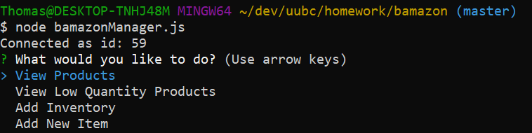

# bamazon

This project contains two different programs the user can run.  

The first is called bamazonCustomer.js.  The user is presented a table with all 
of the items available from the bamazon store.  The user can select an item to buy and enter a quantity.  If there are enough items to purchase, the tranaction will be completed and the program will show the cost of the items purchased.

Screenshots of the bamazonCustomer program:

The second program is called bamazonManager.js.  This program provides additional functionality in the bamazon marketplace.  The manager has a menu where they can view all items, pull a report of items that need to be restocked (five or fewer), add/remove quantities of an item, and add a new item to inventory.

Screenshot of the manager menu:

Screenshot of viewing all items:

Screenshot of the low quantity report:

Screenshot of adding items screen:

Screenshot of adding an item to stock:

